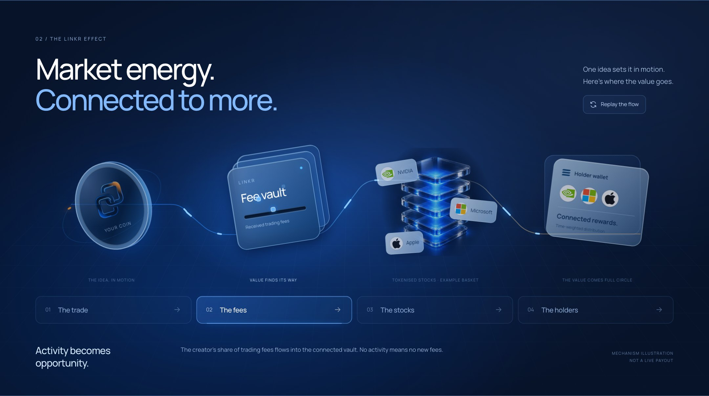
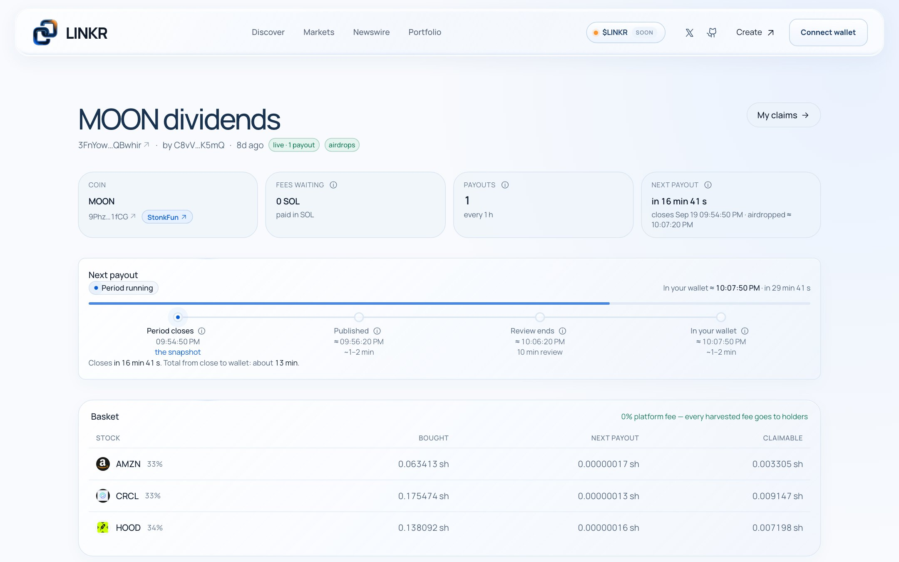
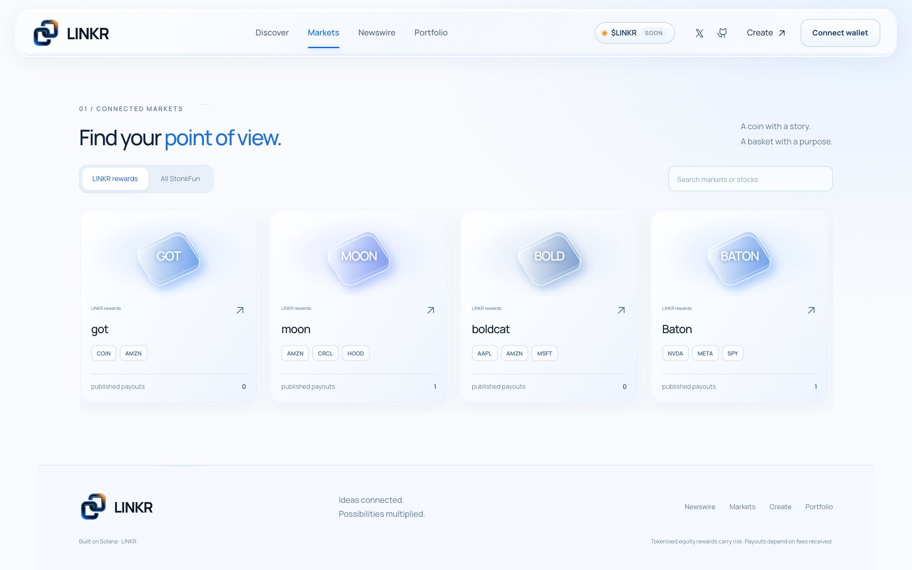
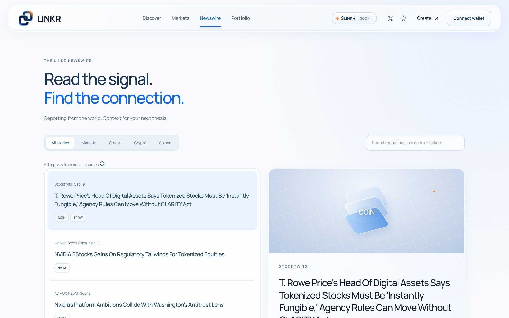
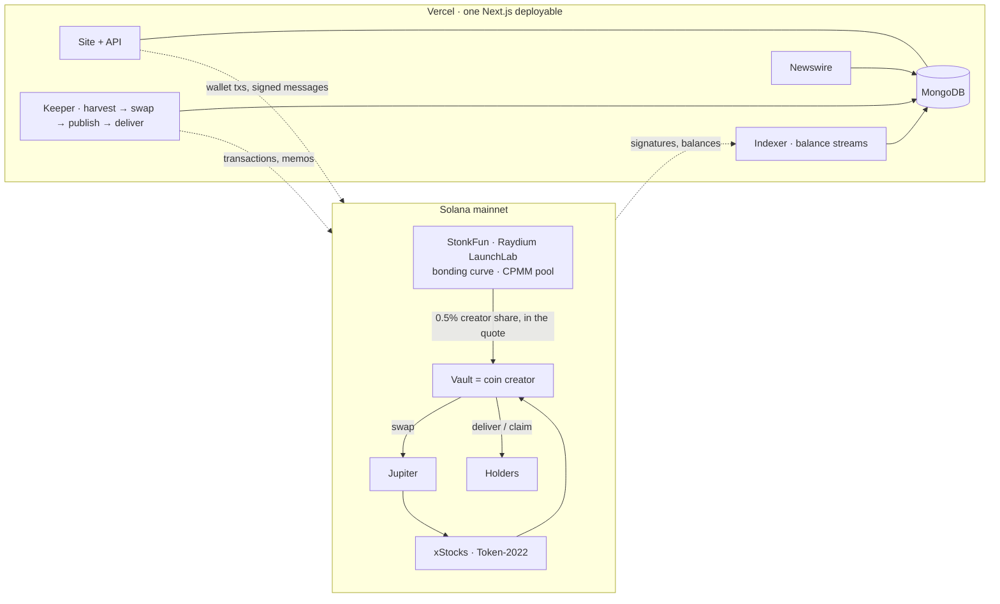

<div align="center">

<a href="https://linkrfun.xyz"></a>

<br>
<br>


# Every market starts with a reason.

**Discover the thesis. Hold the coin. Earn the stocks.**
LINKR launches coins on StonkFun around an idea, and pays their holders in the tokenised stocks that idea is about.

<sub>REAL IDEAS · REAL CONNECTIONS · A MORE OPEN FINANCIAL SYSTEM</sub>

<br>
<br>

[](https://linkrfun.xyz)
[](https://solscan.io)
[](https://www.stonkfun.xyz)
[](https://xstocks.com)
[](#economics)
[](solana/Anchor.toml)
[](web/package.json)
[](LICENSE)

[**Open the app**](https://linkrfun.xyz) · [**X @Linkrfun**](https://x.com/Linkrfun) · [**GitHub**](https://github.com/LINKR-SOL/LINKR-SOL) · [Telegram bot](https://t.me/linkrfun_bot) · [Product book](docs/PRODUCT.md) · [Architecture](docs/ARCHITECTURE.md) · [Go-live guide](docs/DEPLOY.md) · [Audit checklist](docs/AUDIT-CHECKLIST.md)

<br>

**$LINKR** is live on StonkFun · [**Buy on StonkFun**](https://www.stonkfun.xyz/token/9yTuQtzLHxFzdqKuuSiR2e9gYVYutG7nByVittYeVYdW)

CA: `9yTuQtzLHxFzdqKuuSiR2e9gYVYutG7nByVittYeVYdW`

</div>

<br>

> **Custodial and unaudited.** LINKR is live on Solana mainnet in *custodial* mode and has not been independently
> audited. Launch and hold with amounts you are comfortable with.

<br>

## The idea

Price is the result. Movement is the result. Narrative is the result.
Every market starts with a **reason**: LINKR gives that reason a coin, and links the coin to the stocks it is about.

```
EVENT  ─────▶  CONTEXT  ─────▶  THESIS  ─────▶  COIN  ─────▶  STOCKS

a catalyst      what it        the basket       launched on      holders are paid
breaks          touches on     of stocks the    StonkFun with    in the stocks the
                the wire       idea lives in    a vault as       idea was about
                                                its creator
```

StonkFun charges **1%** on every bonding-curve trade and forwards half of it — **0.5%** — to the coin's creator
wallet, in the coin's quote token (SOL, an xStock, USDC…). LINKR makes that wallet a **vault**. The vault converts
the fees into a basket of **xStocks** — Backed's tokenised US equities on Solana (NVDAx, TSLAx, AAPLx, SPYx and 600+ more) — and
pays them out to the coin's holders, weighted by how much they held and for how long.

**LINKR takes a 0% platform fee. Every harvested fee goes to holders.**

<br>

<div align="center">
<a href="https://linkrfun.xyz"></a>
<sub>The connection: the trade → the fees → the stocks → the holders · <a href="https://linkrfun.xyz">linkrfun.xyz</a></sub>
</div>

<br>

## In one minute

<table>
<tr>
<td width="25%" valign="top">

**1 · Create**

In the launch studio: name the coin, pick its quote token, up to ten stocks and their weights, and a payout period. Two signatures.
The coin is a normal StonkFun coin on Raydium LaunchLab; its creator is your vault.

</td>
<td width="25%" valign="top">

**2 · Trade**

Every buy and sell on StonkFun pays the creator's half of the 1% fee to the vault, in the quote token. The
curve, graduation and the Raydium pool are untouched: LINKR never touches the market.

</td>
<td width="25%" valign="top">

**3 · Convert**

The keeper picks up the forwarded fees and swaps them from the quote into the basket through Jupiter, sized to
the market, output measured from the vault's own token accounts.

</td>
<td width="25%" valign="top">

**4 · Airdrop**

At each period's end holders are weighed by balance × time, the split is committed on-chain as a Merkle
root, and the stock is airdropped to every holder's wallet before the next period ends. Nobody has to claim.

</td>
</tr>
</table>

<br>

## The product

| Surface | Route | What it does |
|---|---|---|
| **Discover** | [`/`](https://linkrfun.xyz) | The thesis gallery: themes like *The AI Stack*, *American Defense* and *Musk Economy*, live NVDAx market activity from GeckoTerminal, the newswire, and how a coin's fees become its holders' stocks. |
| **Create** | [`/launch`](https://linkrfun.xyz/launch) | The launch studio: launch a coin on StonkFun (Raydium LaunchLab), quoted in any of its pairs, and pair it to a basket of stocks in one flow. Weights and the payout period are fixed at launch; the vault is the coin's `creator`. |
| **Markets** | [`/vaults`](https://linkrfun.xyz/vaults) | Every LINKR coin, and each coin's page: fees waiting, conversions, payouts, and a live timeline for every step from period close to wallet. Creators harvest or cancel a payout inside its review window. |
| **Portfolio** | [`/claims`](https://linkrfun.xyz/claims) | The connected wallet's stock rewards across every coin: on its way, building up (with the exact time it lands), and the history. Explanations behind every term. |
| **Newswire** | [`/news`](https://linkrfun.xyz/news) | A live newswire read against xStocks: every story linked to the tickers it touches, with live prices and an optional reading of what it changes. If a feed is down the panel says so. |
| **Telegram bot** | [@linkrfun_bot](https://t.me/linkrfun_bot) · `/launch` in a private chat | The same launch from Telegram, one question at a time: name, symbol, logo, story, links, quote, basket, period, initial buy. Then sign with a per-user bot wallet (deposit, withdraw, export key) or hand the draft to `/launch?draft=…` to sign with your own wallet; the chat hears when the coin is live. |

<table>
<tr>
<td width="50%" valign="top">
<a href="https://linkrfun.xyz/launch"></a>
<p align="center"><sub><b>Create</b>: the launch studio. Name the coin, pick the stocks and weights, sign twice</sub></p>
</td>
<td width="50%" valign="top">
<a href="https://linkrfun.xyz/vaults/3FnYowo5u8vR6zrr2yiftmEJKH4BHAi5hczaHAQBwhir"></a>
<p align="center"><sub><b>A coin</b>: fees waiting, the payout timeline to the minute, conversions, payouts ($MOON on mainnet)</sub></p>
</td>
</tr>
<tr>
<td width="50%" valign="top">
<a href="https://linkrfun.xyz/vaults"></a>
<p align="center"><sub><b>Markets</b>: every coin launched through LINKR and its basket</sub></p>
</td>
<td width="50%" valign="top">
<a href="https://linkrfun.xyz/news"></a>
<p align="center"><sub><b>Newswire</b>: the wire, linked to xStocks tickers, with live prices</sub></p>
</td>
</tr>
</table>

<br>

## What is underneath

| | |
|---|---|
| **A vault that is the creator** | LaunchLab's `initialize_with_token_2022` takes a `creator` separate from the payer. The vault is the creator; StonkFun forwards the creator's share of every trade to it and the keeper picks it up. |
| **Real tokenised stocks** | xStocks are Token-2022 mints with the *Scaled UI Amount* extension: splits and dividends change a display multiplier, never the raw balance the vault accounts in. |
| **Measured, never trusted** | Swap output is booked from the vault's token account before and after — never from a quote or a return value. |
| **Time-weighted, Merkle-committed** | Holders are weighed by balance-seconds over the period; the split is a keccak Merkle tree whose root goes on-chain and whose every leaf is public. Recompute it yourself. |
| **A complete indexer** | Holder balances rebuilt from every transaction touching the coin's mint; no third-party indexer, one Next.js deployable with cron routes. |
| **Honest interface** | Every wait shows what is happening and when it ends — period closes → keeper publishes → review → airdropped, each with a wall-clock time, counting down by the second. |

<br>

## Two ways to run vaults

| | `custodial` — **live today** | `program` — the upgrade path |
|---|---|---|
| What a vault is | A wallet only the keeper can reconstruct, derived from its secret + the creator's salt | A PDA of the on-chain `causa_vault` program |
| Who enforces the accounting | The keeper; every payout root is written on-chain as a memo, every leaf is public | The program: measured swaps, Merkle claims, review and claim windows |
| Trust | LINKR, between harvest and delivery | Nobody beyond the program's code |
| Claim | Sign a message; the keeper transfers the stock | Your own transaction with a Merkle proof |
| Cost to deploy | Nothing | ≈ 2.1 SOL refundable rent, once |

One environment variable switches the mode. The indexer, the payout maths, the APIs and the interface are shared.
The program is written, tested (LiteSVM lifecycle) and deployed on devnet, but its `bind_launch` still parses
pump.fun's bonding curve: program mode is deferred until a LaunchLab-aware build. Custodial mode is the supported
mode today and needs no program deployment; vault addresses survive the migration.

<br>

## Architecture



<details>
<summary><b>The launch</b>, two signatures</summary>

<br>

`/launch` generates the coin's mint keypair first, so the vault can commit to the exact coin it will serve.

1. **Prepare the vault** — the vault is registered (custodial: an API call, no rent) and the wallet funds its
   floor and its token accounts, one per stock. ≈ 0.005 SOL.
2. **Launch on StonkFun** — LaunchLab's `initialize_with_token_2022` with `creator = vault`, optionally with an
   initial buy. Rent only (≈ 0.0113 SOL); StonkFun charges no launch fee on this path.

The keeper binds the coin within about two minutes (it reads the LaunchLab pool for the mint and its quote and
checks `creator == vault`) and the first payout period starts. StonkFun adopts the pool within a minute or two
(token page, chart, fee forwarding). Coin metadata is pinned to IPFS via Pinata by `POST /api/launch/metadata`.

</details>

<details>
<summary><b>A payout</b>, fee-funded, time-weighted, Merkle-committed</summary>

<br>

The keeper (`GET /api/cron/dividends`, every two minutes) runs, per vault:

1. **balance stream** — every transaction touching the coin's mint becomes per-owner deltas, backfilled to the
   coin's first transaction;
2. **harvest** — StonkFun's sweeper forwards the creator's 0.5% into the vault's quote token account (wrapped
   SOL for SOL-quoted coins), in batches every hour or two; the keeper unwraps WSOL and takes the idle quote
   (lamports above the rent floor, or the quote token account minus what the ledger already holds),
   measures it and reserves it per basket leg by weight (0% platform fee);
3. **swap** — leg by leg through Jupiter from the quote, signed by the vault, output booked from the token account
   (a leg equal to the quote needs no swap);
4. **publish** — once the period has closed and the stream has caught up: time-weighted balances for every holder
   (the vault, LaunchLab's pool authority and the CPMM authority are excluded), a pro-rata split, a keccak Merkle tree, and the
   root committed on-chain. Recompute it from `GET /api/vaults/:vault/epochs/:id/leaves`;
5. **review** — a fifth of the payout period, at most 10 minutes (a 10-minute coin gets 2), during which the creator
   can cancel a payout that looks wrong;
6. **airdrop** — the keeper's next run sends every holder their stocks: one transfer per stock covering every payout
   they are owed, split across transactions of up to five stocks. Nobody claims; shares under
   `DIVIDEND_AUTOCLAIM_MIN_USD` ($1) add up until they are worth sending, and a holder can ask for them right away from
   their Portfolio. So every period's stocks land before the next period ends. Anything never delivered rolls into a later
   payout after 180 days.

Invariant per leg: `token_account.amount ≥ unallocated + allocated`; an epoch can never pay out more than it
declared; a leaf is delivered once.

</details>

<details>
<summary><b>The indexer</b>, no subgraph</summary>

<br>

- `GET /api/cron/sync` every minute: program events (program mode) and a chain refresh of every vault
- per-coin balance streams walked by the keeper, cursor timestamps from the head block so a quiet coin still
  advances its clock; batched RPC results re-aligned by signature because public RPCs shuffle them
- `POST /api/sync/tx`: the frontend posts every confirmed signature so your own actions appear instantly
- `GET /api/cron/stonkfun` every minute ingests StonkFun's launch ledger and refreshes bound coins' pool state;
  StonkFun publishes no trade stream, so the home tape stays empty unless the `trades` collection is filled

</details>

<br>

## Economics

```
trade on StonkFun ──1%──▶ StonkFun sweeper ──forwards 0.5%──▶ vault (in the quote) ──Jupiter──▶ basket ──TWAB split──▶ holders
                                                                │
                                                                └── 0% to LINKR
```

A coin that does 100 SOL of volume in a day pays 0.5 SOL to its vault (a coin quoted in TSLAX pays in TSLAX); a
holder with 5% of the time-weighted supply receives 5% of the stock that buys. The forward is StonkFun's, off-chain:
its platform sets LaunchLab's on-chain creator fee to 0 and forwards the creator's half itself, so if StonkFun
pauses forwarding, dividends pause. Whether the share continues after graduation into the CPMM pool is an open
question — ask StonkFun. The operator pays the keeper's transaction fees and the rent of
holders' new token accounts; nothing is taken from the pot. (`PROTOCOL_SHARE_BPS` exists, capped at 20%, and is
set to 0.)

<br>

## Deployments

| | Cluster | Address |
|---|---|---|
| App | mainnet | [linkrfun.xyz](https://linkrfun.xyz) |
| Vault keeper (custodial) | mainnet | `71FyeDQG4Mj5tpPTSz7YP3pKc6AJ9UttFkW64AqMTeMJ` |
| `causa_vault` program | devnet | `99n7VGd6132b4UUwhSezLm9xXssdnJFiSPrEKkCuMHPF` |
| Raydium LaunchLab | mainnet | `LanMV9sAd7wArD4vJFi2qDdfnVhFxYSUg6eADduJ3uj` |
| Raydium LaunchLab | devnet | `DRay6fNdQ5J82H7xV6uq2aV3mNrUZ1J4PgSKsWgptcm6` |
| Raydium CPMM | mainnet | `CPMMoo8L3F4NbTegBCKVNunggL7H1ZpdTHKxQB5qKP1C` |
| StonkFun platform (standard) | mainnet | `4E876qZTE9FJMrBzgVtBrSrzz2TLivB5Y5QXPjB4gZL7` |

xStocks and StonkFun's platform exist on mainnet only. On devnet LINKR runs its own LaunchLab platform
(`npm run platform:devnet`), the keeper runs with `DIVIDEND_SWAP=mock` against test mints it controls, and the
vault page grows a *Trade on devnet* box that sends `buy_exact_in` / `sell_exact_in` straight to LaunchLab's
devnet program.

<br>

## Quick start

```bash
git clone https://github.com/LINKR-SOL/LINKR-SOL.git && cd LINKR-SOL/web
cp .env.example .env.local     # MongoDB, RPC URLs, KEEPER_PRIVATE_KEY, CRON_SECRET, BASKET_ALLOWLIST …
npm install
npm run dev                    # http://localhost:3001
npm run dev:all                # + local cron loop (indexer, keeper, StonkFun catalogue)
```

<details>
<summary><b>Devnet, end to end</b></summary>

<br>

```bash
solana config set --url devnet && solana airdrop 2          # or https://faucet.solana.com
npm run platform:devnet                                     # once: LINKR's LaunchLab platform → LAUNCHLAB_PLATFORM_ID
npm run e2e:devnet                                          # vault → LaunchLab coin → second holder → fees → payout → delivery
```

Program mode additionally needs the toolchain (Rust, Solana CLI, Anchor 1.2):

```bash
cd ../solana && anchor build --arch v0 && cargo test -p causa_vault    # LiteSVM lifecycle test
anchor deploy --provider.cluster devnet && cd .. && node scripts/export-idl.mjs
```

</details>

<details>
<summary><b>Mainnet</b></summary>

<br>

[`docs/DEPLOY.md`](docs/DEPLOY.md) is the go-live guide: keys, costs (≈ 0.3 SOL of keeper float in custodial mode),
Helius RPC, Vercel Pro crons, `web/.env.mainnet.example`, `scripts/vercel-env-push.sh`, and the dress rehearsal
to run before sharing the link.

</details>

<details>
<summary><b>Environment variables</b></summary>

<br>

| Variable | Purpose |
|---|---|
| `NEXT_PUBLIC_SOLANA_CLUSTER`, `NEXT_PUBLIC_VAULT_MODE` | `mainnet-beta` / `devnet`; `custodial` / `program` |
| `NEXT_PUBLIC_RPC_URL`, `INDEXER_RPC_URL` | browser / server RPC: Alchemy, Helius or another provider in production |
| `MONGODB_URI`, `MONGODB_DB` | MongoDB |
| `KEEPER_PRIVATE_KEY` | the keeper's secret (base58); custodial vaults are derived from it — back it up |
| `PROTOCOL_SHARE_BPS`, `PROTOCOL_RECIPIENT` | platform share (0) and where it would go |
| `DISPUTE_WINDOW_S`, `CLAIM_WINDOW_S`, `MIN_EPOCH_LENGTH_S`, `VAULT_PAUSED`, `BASKET_ALLOWLIST` | custodial policy: review window, claim window, minimum period, kill switch, allowed stocks |
| `DIVIDEND_MIN_HARVEST`, `DIVIDEND_MAX_SLIPPAGE_BPS`, `DIVIDEND_SWAP`, `DIVIDEND_DUST_UNITS`, `DIVIDEND_EXCLUDED` | harvest threshold (in the vault's quote token), slippage guard, `jupiter` / `mock` / `off`, dust floor, extra excluded owners |
| `DIVIDEND_AUTOCLAIM*` | the airdrop: `off` pauses it; minimum USD per delivery ($1), extra delay (0), retry, holders per run |
| `KEEPER_SWAP_FLOAT_SOL`, `KEEPER_LOW_SOL` | SOL the keeper lends a vault for one swap (covers accounts a route opens), and the balance under which it logs a warning |
| `CRON_SECRET`, `ADMIN_SECRET` | bearer token for `/api/cron/*`; `x-admin-secret` for admin routes |
| `LAUNCHLAB_PLATFORM_ID`, `LAUNCHLAB_CURVE_RULE_ID`, `LAUNCHLAB_RAISE`, `STONKFUN_API_ORIGIN` | LaunchLab platform (devnet: the one `platform:devnet` created; mainnet: defaults to StonkFun standard), optional curve rule, devnet raise target, StonkFun API origin |
| `JUPITER_API_KEY`, `PINATA_JWT`, `BLOB_READ_WRITE_TOKEN`, `OPENROUTER_TOKEN` | optional integrations |
| `NEXT_PUBLIC_SITE_URL` | public origin |
| `NEXT_PUBLIC_LINKR_MINT` | overrides $LINKR's contract address (set in `web/lib/token.ts`) for the navbar ticker, its StonkFun link and the hero's copyable address |
| `TELEGRAM_BOT_TOKEN`, `TELEGRAM_WEBHOOK_SECRET`, `TELEGRAM_WALLET_SECRET` | optional Telegram launch bot: @BotFather token, webhook secret, and the secret every user's bot wallet is derived from — back it up like the keeper key |

</details>

<details>
<summary><b>API</b></summary>

<br>

```http
GET  /api/news · /api/news/health · /api/terminal/pulse · /tape · /feed · /market/:mint
GET  /api/tokens?kind= · /api/launches · POST /api/launches · GET /api/launch/cost · /api/launch/drafts/:id · POST /api/launch/metadata
GET  /api/vaults · /api/vaults/:vault · /epochs · /epochs/:id/leaves · /harvests · /harvest-quote · /api/vaults/config
GET  /api/claims/:account
POST /api/vaults/create · /api/vaults/:vault/actions · /api/claims/:account/deliver     (custodial, wallet-signed)
POST /api/sync/tx · GET /api/cron/{sync,dividends,stonkfun,news} (Bearer $CRON_SECRET) · POST /api/admin/resync
POST /api/telegram/webhook                                                             (X-Telegram-Bot-Api-Secret-Token)
```

</details>

<br>

## Repository

```
web/                     Next.js 16 · TypeScript — site, API, indexer, keeper, newswire
├── app/                 /  /news  /launch  /vaults  /claims  /admin  ·  app/api/**
├── components/          site (nav, brand, $LINKR ticker) · linkr (landing, hero) · launch (studio) · vaults (clocks, claims) · news · ui
├── lib/solana/          cluster + vault mode · program client · PDAs · instruction builders · keeper wallet
├── lib/custody/         custodial mode: derived vault keys · env policy · Mongo ledger · keeper · signed actions
├── lib/indexer/         program sync · balance streams · shared epoch builder · dividend keeper · refresh
├── lib/dividends/       TWAB · Merkle · harvest quoting · excluded owners
├── lib/stonkfun/        StonkFun read layer (client, live feed, types) · lib/launchlab/ (ids, pairs, pool, pricing, tx)
├── lib/launch/           the launch shared by the wizard and the bot: options, vault prep, metadata, cost, record
├── lib/telegram/         the Telegram launch bot: conversation, bot wallets, bot-signed launch, webhook plumbing
├── lib/jupiter/ lib/xstocks/ lib/news/
└── scripts/             LaunchLab devnet e2e · devnet platform setup · mainnet setup · Vercel env push · spikes

solana/                  Anchor 1.2 — the causa_vault program (program mode) + LiteSVM lifecycle test
docs/                    PRODUCT · ARCHITECTURE · DEPLOY · AUDIT-CHECKLIST · archive/
```

<br>

## Testing

```bash
cd web && npm test                          # vitest: TWAB replay, Merkle proofs
cd web && npm run e2e:devnet                # devnet: the whole loop on LaunchLab, custodial mode
cd solana && cargo test -p causa_vault      # LiteSVM: full vault lifecycle + every guard
```

<br>

## Security

This code is **unaudited** and the live deployment is **custodial**: between harvest and delivery, LINKR holds
the fees and the stock. What makes that checkable rather than blind: every payout's root is committed on-chain,
every leaf is public, and every keeper transaction is linked from the vault page. The program mode removes the
trust entirely and is the planned upgrade, once the program is rebuilt to read LaunchLab pools.

[`docs/AUDIT-CHECKLIST.md`](docs/AUDIT-CHECKLIST.md) is the scoped brief for an external review.

<br>

## Roadmap

- [x] `causa_vault` Anchor program with LiteSVM lifecycle test, deployed on devnet
- [x] Web app on Solana: wallet-adapter, launch studio on StonkFun, markets, portfolio, newswire
- [x] Indexer, balance streams, dividend keeper, Jupiter / mock swaps
- [x] Devnet end to end, program mode and custodial mode
- [x] Custodial mode with on-chain memo commitments and wallet-signed actions
- [x] **Mainnet, custodial**: 0% platform fee
- [x] Telegram launch bot ([@linkrfun_bot](https://t.me/linkrfun_bot)): the same launch, signed by a bot wallet or your own
- [x] Automatic airdrops: stocks land in holders' wallets each period, nobody claims
- [x] First real payouts on mainnet (19 Sep 2026): creator fees swapped through Jupiter into AMZNx, CRCLx, HOODx, NVDAx, METAx and SPYx and airdropped to holders
- [x] LINKR identity: the new mark, glass interface, launch studio and thesis gallery
- [ ] Independent security audit · legal review of stock distributions
- [ ] Program mode on mainnet (≈ 2.1 SOL deposit)
- [ ] Post-graduation creator fees on the CPMM pool (confirm with StonkFun) · trade stream for the home tape
- [x] $LINKR launch on StonkFun

<br>

## Brand


**LINKR** is the wordmark. The mark is two open, interlocking links in cobalt glass with one warm edge: an idea,
linked to the market it moves.

<br clear="left">

| | |
|---|---|
| **Voice** | *Every market starts with a reason.* · *Discover the thesis. Hold the coin. Earn the stocks.* · *Real ideas. Real connections.* |
| **Type** | **Manrope**, one family for everything. Contract addresses are set in the system monospace so 0/O and l/I read apart. |
| **Colour** | Mineral white `#F6F9FD` and ink `#102440`, with cobalt `#0967F6` as the one accent and a warm signal `#FF952A` used sparingly. |
| **Surfaces** | Frosted glass panels, soft cobalt light, hairline borders. |
| **Icons** | LINKR's own line glyphs ([`components/ui/icons.tsx`](web/components/ui/icons.tsx)); the X and GitHub marks come from Phosphor. |
| **Coin** | **$LINKR** on StonkFun: `9yTuQtzLHxFzdqKuuSiR2e9gYVYutG7nByVittYeVYdW` |

The vector mark is [`web/app/icon.svg`](web/app/icon.svg) (and `BrandMark` in [`components/site/brand.tsx`](web/components/site/brand.tsx));
the glass render and the thesis artwork are in [`web/public/brand/`](web/public/brand/).

On-chain identifiers keep the project's first name, CAUSA: the `causa_vault` program, the `causa:v1:` memo prefix and the
seeds every vault and bot wallet is derived from. Renaming them would move every vault to a new, empty address, so they stay.

<br>

## License

**GPL-3.0-or-later.** See [LICENSE](LICENSE).

<div align="center">
<br>

<br>
<sub><b>Ideas connected. Possibilities multiplied.</b></sub>
<br>
<sub>Built on <b>Solana</b> · StonkFun · Raydium LaunchLab · Jupiter · xStocks tokenised equities</sub>
<br>
<sub><a href="https://linkrfun.xyz">linkrfun.xyz</a> · <a href="https://x.com/Linkrfun">@Linkrfun</a> · <a href="https://github.com/LINKR-SOL/LINKR-SOL">LINKR-SOL/LINKR-SOL</a> · <a href="https://t.me/linkrfun_bot">@linkrfun_bot</a></sub>
</div>
