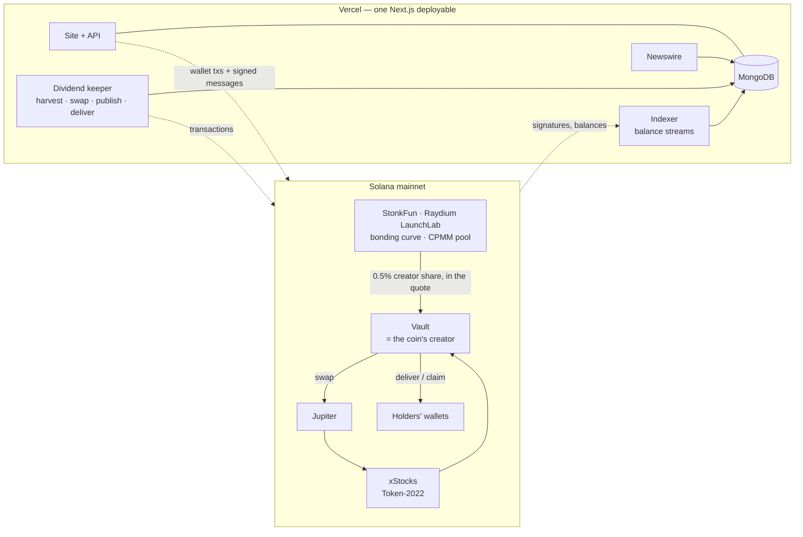

<div align="center">

# LINKR — System Architecture

**StonkFun creator fees → xStocks → holders. On Solana, in one deployable.**

<sub>Product: <a href="PRODUCT.md">PRODUCT.md</a> · Audit scope: <a href="AUDIT-CHECKLIST.md">AUDIT-CHECKLIST.md</a> · Go-live: <a href="DEPLOY.md">DEPLOY.md</a></sub>

</div>

---

## Contents

1. [System at a glance](#1-system-at-a-glance)
2. [Design principles](#2-design-principles)
3. [The chain: StonkFun / Raydium LaunchLab, xStocks, Jupiter](#3-the-chain)
4. [Vaults: two modes, one accounting model](#4-vaults)
5. [The `causa_vault` program](#5-the-causa_vault-program)
6. [The custodial keeper](#6-the-custodial-keeper)
7. [Indexer: balance streams and time-weighted balances](#7-indexer)
8. [Payouts: epochs, Merkle roots, claims](#8-payouts)
9. [Data model](#9-data-model)
10. [HTTP API](#10-http-api)
11. [Frontend](#11-frontend)
12. [End-to-end walkthroughs](#12-end-to-end-walkthroughs)
13. [Operations](#13-operations)

---

## 1. System at a glance



A coin launched through LINKR is an ordinary StonkFun coin (a Raydium LaunchLab pool) with one difference: the
wallet StonkFun forwards creator fees to is a **LINKR vault**. The vault turns those fees — paid in the coin's quote
token — into a fixed basket of **xStocks** (Backed's tokenised US equities on Solana) and pays them out to the coin's
holders, weighted by how much they held and for how long. Liquidity, trading and graduation into a Raydium CPMM pool
stay entirely on StonkFun / Raydium; LINKR never touches the coin's market.

Everything server-side — site, REST API, indexer, keeper, newswire — is one Next.js application with cron
routes. Vault state lives on-chain (program mode) or in the keeper's ledger with on-chain commitments (custodial
mode); everything derived lives in MongoDB.

### Components

| Component | Where | Role |
| --- | --- | --- |
| `causa_vault` program | `solana/programs/causa_vault` (Anchor 1.2) | Program-mode vaults: fee intake, measured swaps, Merkle epochs, claims |
| Custodial keeper | `web/lib/custody` | Custodial-mode vaults: derived wallets, Mongo ledger, on-chain memo commitments, deliveries |
| Indexer | `web/lib/indexer` | Program event walk (program mode), per-coin balance streams, shared epoch builder |
| Dividend keeper | `web/lib/indexer/dividendKeeper.ts` → dispatches to `lib/custody/keeper.ts` in custodial mode | The scheduled loop: bind → stream → (claim, devnet only) → harvest → swap → publish → expire → deliver |
| Newswire | `web/lib/news` | Collect, dedupe, link to xStocks tickers, optional model reading |
| Live feed | `web/lib/stonkfun`, `web/lib/launchlab` | StonkFun catalogue and pool state (cron `/api/cron/stonkfun`); LaunchLab ids, pairs, pool reads, pricing, instruction builders. StonkFun publishes no trade stream, so the home tape is empty unless `trades` is filled |
| Site | `web/app`, `web/components` | Discover, launch studio, markets and coin pages, Portfolio (`/claims`), Newswire, admin |

---

## 2. Design principles

1. **Measured, never trusted.** Balances are read from token accounts before and after every swap; what arrived
   is what is booked. No return value, quote or event is trusted for accounting.
2. **Off-chain computation, on-chain commitment.** Time-weighted balances and the Merkle tree are computed by the
   keeper; the root is committed on-chain (a program account in program mode, a memo in custodial mode) and every
   leaf is served publicly so anyone can recompute it.
3. **One deployable.** No subgraph, no separate indexer service, no queue. Cron routes with idempotent upserts.
4. **Honest UI.** Every waiting state shows what is happening and when it will be done; a feed that is down says
   so; a vault that has nothing to pay says why.
5. **Cheap to run, upgradeable to trustless.** Custodial mode launches for a fraction of a SOL; program mode is
   the same accounting enforced by a program, for when the rent deposit is affordable.

---

## 3. The chain

### StonkFun on Raydium LaunchLab

- **StonkFun** (stonkfun.xyz) is a launchpad whose new launches run on Raydium LaunchLab: a coin trades on a
  bonding curve first and migrates into a Raydium CPMM pool once the curve has raised its target ("graduation").
  A pool is attributed to StonkFun through its platform id, and StonkFun adopts matching pools within a minute or
  two (token page, chart, fee forwarding).
- **`initialize_with_token_2022`** (built with `@raydium-io/raydium-sdk-v2`) takes a `creator` separate from the
  `payer`. LINKR sets `creator = vault`. The coin is a Token-2022 mint, 6 decimals, 1B supply, 793.1M sold on the
  curve. Creation costs rent only (≈ 0.0113 SOL); StonkFun charges no launch fee on this path.
- **Quote tokens**: a coin can be launched against any of StonkFun's launchable pairs — xStocks, PreStocks,
  Sunrise, currencies (USDC, USDT, EURC…), leverage, collectibles, SOL, custom tokens. The wizard's picker is
  driven live by `GET /api/public/v1/pairs`; the vault stores `quoteMint`, `quoteTokenProgram`, `quoteDecimals`.
- **Creator fees**: StonkFun's standard pool charges 1% on every curve trade; the platform sweeps it and forwards
  the creator's half (0.5%) to the pool's `creator`, **in the quote token**, as a token transfer from its fee
  wallet (`5CEbueQnq1Ym2uSSx2xXds3jQAqT1BDnkA59RZobSPAG`) into the creator's token account of the quote — a
  wrapped-SOL account for SOL-quoted coins, never native lamports — batched every hour or two (observed
  2026-09-10). The vault therefore opens that account at launch, and the keeper unwraps WSOL before harvesting.
  There is no permissionless on-chain collect on mainnet: the platform sets LaunchLab's on-chain creator fee rate
  to 0 and forwards off-chain.
  This is a trust in StonkFun — if forwarding pauses, dividends pause. What happens after graduation into the CPMM
  pool is open (the pricing response shows `cpmmCreatorFeeOn: 0`): ask StonkFun.
- The LaunchLab pool account records the `creator`, which is how a vault is **bound** to a coin: read the pool for
  (`expected_mint`, `quoteMint`), check `creator == vault`, start the clock. Pool status: 0 trading on the curve,
  1 raise complete, 2 migrated.
- Program ids: LaunchLab `LanMV9sAd7wArD4vJFi2qDdfnVhFxYSUg6eADduJ3uj` (devnet
  `DRay6fNdQ5J82H7xV6uq2aV3mNrUZ1J4PgSKsWgptcm6`), CPMM `CPMMoo8L3F4NbTegBCKVNunggL7H1ZpdTHKxQB5qKP1C`; StonkFun
  platform config (standard) `4E876qZTE9FJMrBzgVtBrSrzz2TLivB5Y5QXPjB4gZL7`. Read layer `web/lib/stonkfun`
  (`/tokens`, `/stats`, `/launches`; 300 req/min per IP, no key).

### xStocks

Backed's tokenised equities: **Token-2022** mints with three extensions that matter here.

| Extension | Effect | How LINKR handles it |
| --- | --- | --- |
| Scaled UI Amount | Splits and reinvested dividends change a display multiplier; raw balances never move | All accounting is in raw units; the multiplier is applied only when rendering |
| Pausable | The issuer can pause transfers | A delivery to a paused stock fails and is retried later; nothing is lost |
| Permanent Delegate | The issuer can move balances | Documented trust in the issuer; the same holds for every xStocks holder |

The registry (`web/lib/stock-tokens.generated.ts`, 637 Solana mints) is generated from Backed's public API by
`scripts/gen-stock-tokens.mjs`. Prices come from Jupiter's price API, GeckoTerminal as fallback.

### Jupiter

Quote → xStock swaps go through Jupiter (`/swap/v1/quote`, `/swap/v1/swap-instructions`) with the vault's quote
as the input mint and the vault's Token-2022 associated token account as **`destinationTokenAccount`**, so the
output lands where the vault accounts for it. A leg equal to the quote needs no swap. Address lookup tables keep the transaction under 1232 bytes (measured: ~870 bytes with three
tables for a SOL→NVDAx route). Quotes are size-capped and halve on failure so a thin market is never dumped into.

---

## 4. Vaults

A vault is defined by `(creator, salt)` and commits to `expected_mint` before the coin exists; the launch wizard
generates the coin's mint keypair first, so the vault can only ever be bound to that one coin.

| | `program` mode | `custodial` mode |
| --- | --- | --- |
| Vault identity | PDA `["vault", creator, salt]` owned by `causa_vault` | Keypair derived as `sha256("causa-custodial-vault-v1" ‖ keeper_secret[0..32] ‖ creator ‖ salt)` — only the keeper can reconstruct it |
| Fee custody | PDA + its token accounts | The derived wallet + its token accounts |
| Accounting | `Vault` account fields, enforced by the program | Mongo ledger written only by the keeper (`lib/custody/ledger.ts`) |
| Swap safety | `swap_begin` / `swap_settle` in one transaction, delta measured on-chain | Delta measured by the keeper from token balances before/after |
| Epoch commitment | `Epoch` account with root, amounts, windows | Memo transaction: `causa:v1:epoch:<vault>:<id>:<root>:<start>-<end>:<holders>` |
| Claim | Holder's transaction with a Merkle proof; `ClaimStatus` PDA prevents double claims | Holder signs a message; keeper transfers from the vault; leaf marked claimed |
| Creator actions | Instructions signed by the creator | Messages signed by the creator, verified server-side |
| Policy | On-chain `Config` (admin, operator, windows, allowlist) | Environment (`PROTOCOL_SHARE_BPS`, `DISPUTE_WINDOW_S`, `CLAIM_WINDOW_S`, `MIN_EPOCH_LENGTH_S`, `BASKET_ALLOWLIST`, `VAULT_PAUSED`) |
| Trust | None beyond the program's code | LINKR, for the window between harvest and delivery |
| Cost to deploy | ≈ 2.1 SOL refundable rent for the 413 KB program | none |

Both modes share the same invariant per basket leg:

```
token_account.amount  ≥  unallocated + allocated        (+ pending_swap, in the quote, for legs not yet swapped)
```

where `unallocated` is stock waiting for the next epoch, `allocated` is stock committed to open epochs and not
yet claimed, and every epoch's `claimed_totals ≤ amounts`. Cancelled or expired epochs move their remainder back
to `unallocated`.

The mode is one environment variable (`NEXT_PUBLIC_VAULT_MODE`). Indexer, epoch builder, APIs and UI are shared;
vault documents carry `programId` = the program id or the literal `custodial`.

---

## 5. The `causa_vault` program

Anchor 1.2, built with `anchor build --arch v0`. Program id `99n7VGd6132b4UUwhSezLm9xXssdnJFiSPrEKkCuMHPF`
(deployed on devnet; the same keypair is used for any cluster).

**Unchanged by the StonkFun migration.** `bind_launch` still parses pump.fun's bonding curve, so program mode is
deferred until a LaunchLab-aware build. Custodial mode (§6) is the supported mode and needs no program deployment.

### Accounts

| Account | Seeds | Holds |
| --- | --- | --- |
| `Config` | `["config"]` | admin + pending admin, operator, protocol share (bps, ≤ 2000), recipient, dispute window, claim window, min epoch length, paused |
| `AllowedBasketMint` | `["basket", mint]` | mint + token program a creator may put in a basket |
| `Vault` | `["vault", creator, salt_le]` | basket legs (mint, token program, decimals, weight bps, `unallocated`, `allocated`, `pending_swap`, `harvested_total`), epoch length, `expected_mint`, `launch_mint`, `bound_at`, `last_period_end`, `epoch_count`, totals, `auto_claim`, swap session (`swap_in_flight`, `swap_leg`, `swap_pre_balance`) |
| `Epoch` | `["epoch", vault, id_le]` | root, per-leg amounts and claimed totals, period, `claimable_at`, status |
| `ClaimStatus` | `["claim", epoch, account]` | exists once a holder has claimed that epoch |

### Instructions

| Group | Instruction | Who | What it enforces |
| --- | --- | --- | --- |
| admin | `init_config`, `update_config`, `transfer_admin` / `accept_admin`, `allow_basket_mint`, `revoke_basket_mint` | admin | two-step admin, share cap |
| lifecycle | `create_vault(salt, weights, epoch_length, expected_mint)` | creator | 1–10 legs, weights sum to 10 000, allowlisted mints, epoch ≥ minimum |
| | `bind_launch` | anyone | reads pump.fun's `BondingCurve` for `expected_mint` (to be replaced by the LaunchLab pool), requires `creator == vault`; starts the first period |
| | `set_auto_claim` | creator | opt in to keeper-paid delivery |
| harvest | `wrap_fees` | operator / creator | lamports above rent → the vault's WSOL account (a top-level `sync_native` follows) |
| | `harvest_intake(max_input)` | operator / creator | folds stray basket balances, measures new WSOL, takes the protocol share, reserves the rest per leg by weight |
| | `swap_begin(leg)` | operator | hands the leg's reserved WSOL to the operator, records the pre-balance, and **requires a `swap_settle` for the same leg later in the same transaction** (instructions sysvar) |
| | `swap_settle(leg, min_out)` | operator | books `post − pre ≥ min_out` into `unallocated[leg]` |
| epochs | `publish_epoch(root, amounts, period, holders)` | operator | `period_start == last_period_end`, amounts ≤ unallocated; moves them to allocated; `claimable_at = now + dispute_window` |
| | `cancel_epoch` | creator / admin, inside the window | remainder back to unallocated |
| | `expire_epoch` | anyone, after the claim window | remainder back to unallocated |
| claims | `claim(epoch_id, amounts, proof)` | payer for any account | keccak Merkle verification, one `ClaimStatus` per (epoch, account), transfers from the vault's token accounts |
| | `rescue` | admin, paused | recover tokens that are not part of any accounting |

Why the SOL wrap is its own instruction: a `sync_native` CPI from inside `harvest_intake` would need the vault in
its account list to satisfy the runtime's balance check, and the real SPL Token program rejects extra accounts
(LiteSVM did not). `wrap_fees` moves lamports, the client sends `sync_native`, `harvest_intake` measures.

### Merkle scheme

Leaf `keccak(0x00 ‖ epoch_id_le ‖ account ‖ n ‖ amounts_le…)`, node `keccak(0x01 ‖ min(a,b) ‖ max(a,b))`, leaves
sorted by account. The TypeScript builder (`web/lib/dividends/merkle.ts`, `@noble/hashes`) and the Rust verifier
(`merkle.rs`) are byte-identical and cross-tested.

### Events

Emitted with `emit_cpi!` (self-CPI), decoded from inner instructions so log truncation can never lose one. Vault
state is always re-read from the account after an event rather than reconstructed from it.

### Tests

`solana/programs/causa_vault/tests/vault.rs` (LiteSVM): plants a pump `BondingCurve` naming the vault as
creator, drops fees on the PDA as lamports (exactly what `collect_creator_fee` does), mocks Jupiter with a
`mint_to` between `swap_begin` and `swap_settle`, publishes, claims, expires — asserting the invariant after every
step and that each guard rejects (wrong creator, bad weights, missing settle, short output, early publish, bad
proof, double claim, stranger cancel, over-cap share).

---

## 6. The custodial keeper

`web/lib/custody/keeper.ts`, entered from the same cron route through `runDividendKeeper` when
`NEXT_PUBLIC_VAULT_MODE=custodial`. Under a Mongo lease, per vault:

1. **Bind** — pending vaults whose LaunchLab pool for (`expected_mint`, `quoteMint`) has `pool.creator == vault`:
   `status → active`, `last_period_end = now`, the coin's balance stream is created (the pool address is recorded
   in Mongo).
2. **Balance streams** — shared with program mode (§7).
3. **Harvest** — the intake is *idle quote on the vault*: StonkFun forwards the creator's 0.5% there. For SOL,
   whatever sits in the vault's wrapped-SOL account is unwrapped first (close, then re-open the account with the
   vault's own rent), then `input = lamports − floor − Σ pending_swap` (the floor is the rent-exempt minimum of an
   empty account); for a
   token quote, the vault's quote token account minus what the ledger already accounts for. If it is ≥
   `DIVIDEND_MIN_HARVEST` (whole units of the quote), transfer the protocol share (0 in production) and record
   per-leg reservations in the ledger. On devnet, where LINKR's own platform keeps an on-chain creator fee, the
   keeper first sends LaunchLab's `claimCreatorFee` signed by the vault.
4. **Swap** — per leg with quote reserved: Jupiter `swap-instructions` with `userPublicKey = vault`, input mint =
   the quote (`wrapAndUnwrapSol = true` for SOL), destination = the vault's stock account; signed by the keeper (fee
   payer) **and the vault**; output measured from the token account before/after. A leg equal to the quote needs
   no swap. `DIVIDEND_SWAP=mock` (devnet) mints the quoted amount instead and moves the quote to the keeper so the
   ledger still balances.
5. **Publish** — the shared epoch builder (§8) → documents persisted → **memo transaction** with the root → ledger
   moves amounts from `unallocated` to `allocated`, `claimable_at = now + review window`, where the review window is
   a fifth of the payout period capped at `DISPUTE_WINDOW_S` (`reviewWindowFor` in `lib/launch/options.ts`).
6. **Expire** — epochs past `CLAIM_WINDOW_S` roll their remainder back.
7. **Airdrop** — every vault, every payout, no claiming: once a payout clears its review window the keeper sends each
   holder one `transfer_checked` per stock covering every open payout they are owed (up to 24), in transactions of
   up to five stocks (keeper creates their token accounts). Each leaf records the legs it has received
   (`sentLegs`), so a delivery cut short resumes without paying a leg twice. Policy: `DIVIDEND_AUTOCLAIM=off`
   pauses it; shares under `DIVIDEND_AUTOCLAIM_MIN_USD` wait until they add up; a holder can ask for theirs at
   once from the Portfolio (a signed message).

**Signed actions.** With no instruction to prove intent, creator and holder actions are messages
`LINKR <action> <target> <unixSeconds>` signed by the wallet (`signMessage`) and verified server-side
(`lib/custody/auth.ts`: ed25519 over the UTF-8 bytes, action and target bound, 5-minute freshness). Routes:
`POST /api/vaults/create`, `POST /api/vaults/:vault/actions` (harvest, autoclaim, cancel),
`POST /api/claims/:account/deliver`.

**What the keeper can and cannot do.** It holds the vault keys, so between harvest and delivery it *could* move
funds — that is the custodial trust. It cannot change what a holder is owed after publishing without leaving a
mismatch between the on-chain memo, the served leaves and the deliveries; all three are public.

---

## 7. Indexer

### Program events (program mode only)

`GET /api/cron/sync` walks `getSignaturesForAddress(program)` newer than the cursor, oldest first, in small
batches; every transaction's inner-instruction events are decoded and upserted; the cursor advances only after
everything older is stored. `POST /api/sync/tx` ingests a single signature on demand (the frontend posts every
confirmed transaction so a user's own action shows up instantly). Every ten minutes every vault is re-read from
chain (reconcile). Batched `getParsedTransactions` responses are re-aligned by signature because public RPCs
return them out of order.

### Balance streams (both modes)

For every bound coin a `TransferStreamDoc` walks `getSignaturesForAddress(mint)`: forward from the cursor every
run, and once backwards to the coin's first transaction (`backfilled`). Each transaction's pre/post token balances
become signed per-owner deltas (`BalanceChangeDoc {owner, delta, slot, index, timestamp}`). The stream's
`cursorTimestamp` is the head block time read *before* each walk, so a quiet coin still advances its "complete up
to" clock.

### Time-weighted average balances

`web/lib/dividends/twab.ts` replays deltas over `[period_start, period_end)`, accumulating balance-seconds per
owner (`acc`) from a starting snapshot (the previous period's end) plus the period's changes. Excluded owners
(`excluded.ts`: the vault, LaunchLab's pool authority PDA — it owns every curve's token vault — the CPMM authority,
`DIVIDEND_EXCLUDED`)
count as supply but earn nothing. `allocate()` splits each leg's total pro rata to `acc`, drops dust, and keeps
the flooring residue in the pot.

---

## 8. Payouts

`web/lib/indexer/epochBuild.ts` is shared by both modes:

1. A period has elapsed (`now ≥ period_start + epoch_length`) **and** the balance stream has passed its end
   (`cursorTimestamp ≥ period_end`). One epoch covers every full period that has elapsed, so a period with an
   empty pot simply rolls into the next.
2. Legs below `DIVIDEND_DUST_UNITS` roll forward; if every leg is below it, nothing is published.
3. TWAB → allocation → Merkle tree → `EpochDoc` (root, amounts, period, tree dump), one `EpochLeafDoc` per
   holder (amounts, proof, acc), and a `HolderSnapshotDoc` per owner at `period_end` for the next replay.
4. Program mode: `publish_epoch`. Custodial mode: memo + ledger.
5. `claimable_at = published + review window` (a fifth of the period, at most 10 minutes in production); the
   creator or admin can cancel inside it, and the stocks are airdropped right after. Anything not delivered within
   the claim window (180 days) `expire`s back into the pot.

Every leaf set is public at `GET /api/vaults/:vault/epochs/:id/leaves`; anyone can rebuild the root.

---

## 9. Data model

MongoDB, one database per cluster (`linkr` / `linkr-mainnet`). Amounts are decimal strings of raw units; ids are deterministic so every
write is an idempotent upsert.

| Collection | Key | Content |
| --- | --- | --- |
| `vaults` | `cluster:vault` | basket, epoch length, `expected_mint`, `launch_mint`, quote (`quoteMint`, `quoteTokenProgram`, `quoteDecimals`), status, period clock, per-leg accounting, fee balances, auto-claim, `programId` |
| `launches` | `cluster:mint` | StonkFun / LaunchLab coin: creator, deployer, metadata, quote, pool state (0 trading · 1 raise complete · 2 migrated), source |
| `trades` | signature | live trades for the tape (StonkFun publishes no stream, so empty unless filled) |
| `harvests`, `swaps` | `signature:ix` | intake and settle records |
| `epochs`, `epoch_leaves`, `holder_snapshots` | see §8 | payouts, proofs, period-end balances |
| `claims` | `signature:ix` | deliveries / claims |
| `transfer_streams`, `balance_changes` | `cluster:mint`, `signature:owner` | per-coin balance history |
| `tokens` | `cluster:mint` | xStocks / launch coins / quote tokens metadata, Scaled UI state, prices |
| `news`, `source_runs` | | the newswire and per-source health |
| `sync_state`, `locks` | | program cursor, keeper lease |

---

## 10. HTTP API

```http
# The newswire and the tape
GET  /api/news · /api/news/health
GET  /api/terminal/pulse · /tape · /feed · /market/:mint

# Tokens and launches
GET  /api/tokens?kind= · /api/tokens/:mint/reference-price
GET  /api/launches?creator=&deployer=          POST /api/launches
GET  /api/launch/cost?legs=                    POST /api/launch/metadata · POST /api/upload

# Vaults and payouts
GET  /api/vaults?creator=&mint=                GET /api/vaults/:vault?refresh=1
GET  /api/vaults/:vault/epochs · /epochs/:id/leaves · /harvests · /harvest-quote
GET  /api/vaults/config                        GET /api/claims/:account
POST /api/vaults/create                        (custodial) register a vault
POST /api/vaults/:vault/actions                (custodial) harvest · autoclaim · cancel — wallet-signed
POST /api/claims/:account/deliver              (custodial) claim — wallet-signed

# Operations
POST /api/sync/tx
GET  /api/cron/sync · /dividends · /stonkfun · /news    Authorization: Bearer $CRON_SECRET
POST /api/admin/resync                              x-admin-secret: $ADMIN_SECRET
```

---

## 11. Frontend

Next.js 16 (App Router, Turbopack), TypeScript, Tailwind 4, `@solana/wallet-adapter` (wallet-standard: Phantom,
Solflare, Backpack, MetaMask), Anchor client in program mode, Motion for animation, Phosphor icons.

- **Transactions** (`lib/hooks/useSolanaTx.ts`): build → simulate against the app's RPC → fee/balance check →
  `sendTransaction` through the adapter (which tells the wallet the cluster) with a sign-and-send fallback →
  confirm → `POST /api/sync/tx` → invalidate queries. Errors are translated (`0x0` = "an earlier attempt landed").
- **Signed actions** (`lib/hooks/useSignedAction.ts`): custodial creator/holder actions.
- **Launch wizard**: coin → quote (picker driven live by StonkFun's `/api/public/v1/pairs`, grouped by their
  `categoryLabel`) → basket (drag to rebalance, allowlisted stocks only) → review. Custodial: `POST /api/vaults/create`,
  one *prepare* transaction (wallet floor + stock accounts), then LaunchLab `initialize_with_token_2022` (+ optional
  buy). Program mode (deferred) would add `create_vault` before and `bind_launch` after. The mint keypair is
  persisted so a reload resumes.
- **Vault page**: stats with explanations, binding clock (launch → bind → fees flow → first payout), basket
  table, fee conversions, payouts, creator actions, devnet trade box (`buy_exact_in` / `sell_exact_in` sent straight
  to LaunchLab's devnet program).
- **Portfolio (`/claims`)**: claimable / building up / claimed, projection cards with a live period bar and the
  payout clock (period closes → keeper publishes → review window → claimable, each with a wall-clock time), plain
  reasons when there is nothing to claim, claim history.
- **Live time**: every relative time ticks on its own one-second clock; the pages refetch every 15–30 s.
- **Honesty rule**: a feed that is down says so; every number has a source; nothing is filled in.

---

## 12. End-to-end walkthroughs

### A launch (custodial)

1. Wizard generates mint keypair `M`, posts `{creator, salt, legs, weights, epochLength, expectedMint: M}` →
   server derives vault `V`, stores it `pending`.
2. Wallet signs *Prepare*: 0.00089 SOL floor to `V` + `V`'s token accounts for each stock (≈ 0.002 SOL each).
3. Wallet signs LaunchLab `initialize_with_token_2022(creator = V)` (+ initial buy), partially signed by `M`; the
   pool carries StonkFun's platform id, so StonkFun adopts it within a minute or two.
4. Keeper tick: the pool for (`M`, quote) names `V` as creator → bound, `last_period_end = now`, balance stream
   starts backfilling.

### A payout

1. Trades on StonkFun pay 1%; StonkFun's sweeper forwards 0.5% to `V` in the quote token.
2. Keeper tick: idle quote ≥ threshold → reserve per leg → Jupiter swap from the quote signed by `V` → stock in
   `V`'s token account, booked at the measured amount.
3. Period end passes and the stream catches up → epoch built → memo with the root → review window (a fifth of the
   period, at most 10 minutes).
4. The keeper's next run airdrops it → `transfer_checked` to every holder's wallet → leaves spent, `claims`
   recorded, the Portfolio shows it under Received.

### A launch (program mode — deferred until the program reads LaunchLab pools)

Same shape, with `create_vault` instead of the API call, `bind_launch` as a third transaction (or by the keeper),
`wrap_fees + sync_native + harvest_intake` for intake, `swap_begin/settle` around the swap, `publish_epoch`, and
`claim` with a proof.

---

## 13. Operations

- **Crons** (`web/vercel.json`): `sync` and `stonkfun` every minute, `dividends` every two, `news` every five — Vercel
  Pro; the keeper also runs the balance streams. `scripts/local-cron.mjs` does the same locally.
- **RPC**: Helius (or another provider) in production; the public endpoints throttle the batched history calls.
- **Pause**: `VAULT_PAUSED=1` (custodial) or `update_config(paused)` (program) stops harvests, publishes and
  deliveries; already-delivered stock is unaffected.
- **Keys**: `KEEPER_PRIVATE_KEY` is the only secret custodial vaults depend on; back it up outside the host.
- **Devnet**: StonkFun's platform is mainnet-only, so `scripts/launchlab-devnet-platform.ts` (`npm run
  platform:devnet`) creates LINKR's own LaunchLab platform (0.5% platform fee + 0.5% on-chain creator fee, so the
  keeper's `claimCreatorFee` path is exercised); its id goes in `LAUNCHLAB_PLATFORM_ID`. Devnet has LaunchLab configs
  for SOL and a mock USDC (`USDCoctVLVnvTXBEuP9s8hntucdJokbo17RwHuNXemT`) only; `LAUNCHLAB_RAISE` (default 85) sets
  the raise in whole quote units. `DIVIDEND_SWAP=mock`, lowered thresholds, the vault page's trade box;
  `scripts/launchlab-e2e.ts` (`npm run e2e:devnet`) runs the whole loop.
- **Go-live checklist**: `DEPLOY.md`.
